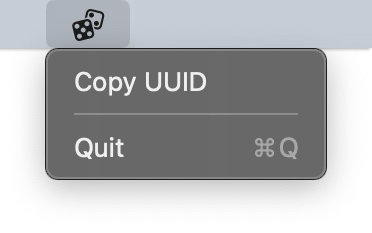
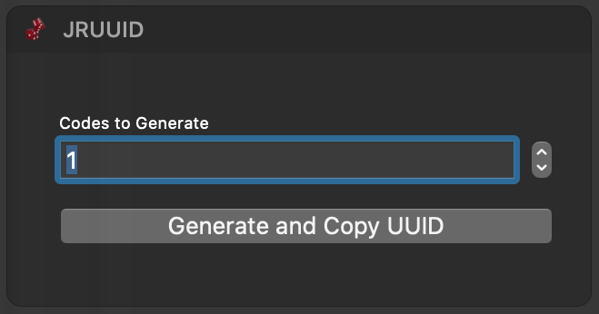

jrUUID
======

A simple UUID/GUID generator for macOS. 

## Why?

Every now and then we need to generate a UUID, while using something like `uuidgen` is fine it can be annoying if you need generate a number of them.

This app lives in the menu bar and in Notification Center.

## Screenshots

## License

[GNU General Public License v3 (GPL-3) ](https://tldrlegal.com/license/gnu-general-public-license-v3-(gpl-3))